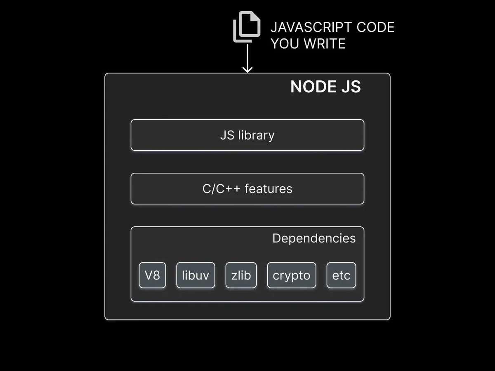

# NodeJS

## Run time

### NodeJS runtime



### Browser runtime


## CommonJS Modules

In NodeJS every module is an **IIFE,** so each time you import a module Node JS run the IIFE as followed:

```js
// a NodeJS module

(function(exports, module, require, __dirname, __filename) {
  // module code
})();
```

Where `exports` is just a reference to `module.exports`

```js
exports = module.exports;
```

And the return value of the **importing module `require` function** is always a cached version (no longer a reference) taken from the object referred to by the **exporting module `module.exports` object, not taken through this exporting module `exports`.**

### **`node:...`  Protocol**

From NodeJS 18 onward is it recommended to prefix all built-in imports with the **node protocol** like so:

```js
const path = require("node:path");
```

1. Makes it perfectly clear that the import is a Node built-in module.
2. Makes the import identifier a valid absolute URL.
3. Avoids conflict for NodeJS built-in module.

## **`node:events` module**

Must of Node builtin modules like `fs`, `stream` or `http` extends from the `EventEmitter` class.

## **`node:fs` module**

The callback base version of the fs module API is preferable over the promise base API when maximum performance is required both in term of execution time and memory allocation. Otherwise it is perfectly ok to stick with the promise base fs module.

## Streams

**What?**  
A stream is a sequence of data that is being moved from one point to another over time. **Example:** a stream of data being transferred from one file to another within the same computer.

**Why?**  
It allows to work with data in chunks instead of waiting for the entire data to be available at once. If you are transfering file contents from fileA to fileB, you don't wait for entire fileA content to be saved in temporary memory before moving it into fileB. Instead, the content is transferred in chunks over time which prevents unnecessary memory usage.

📝 **`stream`** is in fact a built-in node module that inherits from the **`EventEmitter`** class (`events` module)

|Stream Types|Examples|
|-|-|
|**Readable Streams** from which data can be read|Reading from a file as readable stream|
|**Writable Streams** to which data can be written|Writing to a file as writable stream|
|**Duplex Streams** that are both **Readable** and **Writable**|**Sockets** as a duplex stream|
|**Transform Streams** that can **modify** the data as it is **written** and **read**|File compression where you can write compressed data and read de-compressed data to and from a file as a transform stream|

- Stream uses a **`buffer`** with a default size of **64kb** which can be tampered as followed:

```js
const readableStream = fs.createReadStream("./streaming_1.txt", {
  encoding: "utf-8",
  // resetting buffer size
  highWaterMark: 4,
});
```

## Pipes

**What?**  
The `pipe` method of `readableStream` allows incapsulate both the eventlistener capability from `readableStream` and the writable capability from `writableStream` from this:

```js
readableStream.on("data", (chunk) => {
console.log(chunk);
writableStream.write(chunk);
});
```

to this:

```js
readableStream.pipe(gzip).pipe(fs.WriteStream("./streaming_2.txt.gz"));
```

**Why?**  
Since the `pipe` method returns the destination stream it enables **stream chaining,** at the mandatory condition that the origin stream is **readable**(thus otherwise **duplex or transform.**)

## libuv for Thread pool and Event loop

**What?**  
libuv is a cross platform open source library written in C language.

**Why?**  
It handless asynchronous non-blocking operations in NodeJS.

**How?**  
With **thread pool** and **event loop.**


- Experiment 1 inference: **Sequential execution**  
In NodeJS every method with the suffix 'sync' always runs on the main thread and is blocking.

- Experiment 2 inference: **Parallel execution**  
A few methods like `fs.readFile` and `crypto.pbkdf2` run on a separate thread in **libuv's thread pool**. They do run synchronously in their own thread but as far as the main thread is concerned, it appears as if the methos is running asynchronously.

- Experiment 3 inference: **Asynchronous method execution**  
libuv thread pool has **4 threads** by default.

- Experiment 4 inference: **By increasing the thread pool**  
we are able to improve the total time taken to run multiple calls of an asynchronous method like `pbkdf2`

  **WARNING:**  
  **If you increase the thread pool size beyond the number of cores your machine CPU has the average time taken per method execution also increases.**

- Experiment 5 inference: Increasing the thread pool size can help with performance but that is limited by the number of available CPU cores.

- Experiment 6 inference: `https.request` is not a ***input/output*** operation and not a ***CPU bound*** operation therefore it does not use the thread pool. **Libuv** instead delegates the work to the system kernel and whenever possible, it will poll the kernel and see if the request has completed.

### Summary

In NodeJS async method are handled by **libuv** in two different ways:

1. Native async mechanism
2. Thread pool

Whenever possible, **libuv** will use the native async mechanism in the OS as to avoid blocking the main thread. Since this is part of the kernel, there is different mechanism for each OS:

|Linux|MacOS|Windows|
|-|-|-|
|epoll|Kqueue|IO Completion Port|

Relying on native async mechanisms makes Node scalable as the only limitation is the operating system kernel.

If there is no native async support and the task is file I/O or CPU intensive, libuv uses the thread pool to avoid blocking the main thread. Although the thread pool preserves asynchronounicity to respect to Node's main thread, it can still become a bottleneck if all threads are busy.

## The Event loop

<https://www.builder.io/blog/visual-guide-to-nodejs-event-loop>
<https://youtu.be/L18RHG2DwwA?si=981lnQolFTE_twFZ>


**What?**  
As a C program and part of libuv, the event loop is a design pattern that co-ordinates the execution of synchronous and asynchronous code in NodeJS.

- **The synchronous call stack is allways entirely run before control shift to asynchronous callbacks in the event loop**.

The event loop orchestrates the execution of callback functions in six differents queues in order of precedence **nextTick, Promise, timer, I/O, check and close queues.**

1. call **`process.nextTick()`** method to queue into the the **nextTick queue.**
2. **`resolve`** or **`reject`** a **`Promise`** to queue into the **Promise queue.**
3. call **`setTimeout()`** or **`setInterval()`** method to queue into the the **timer queue.**
4. execute an **async method** to queue into the **I/O queue.**
5. call **`setImmediate()`** function to queue into the the **check queue.**
6. attach **`close` event listener** to queue into the **close queue.**

The **order of execution** is the same with two exeptions:

- **nextTick and Promise queue** are executed in between each queue and in between each callbacks within the **timer** and **check** queue.
- it may happen that **check queue** is executed while **I/O queue** data are not yet available in case of big file reading. The event loop will poll I/O queue to get the data and run its callback on second iteration, giving the illusion that check queue ran before I/O queue.

## **`node:cluster` module**

**Why?**  
Since Node is single threaded, no matter how many cores you have, Node only uses a single core of your CPU. This is fine for I/O operations but if the code has long running and CPU intensive operations, your application might struggle from a performance point of view.

**What?**  
To solve this issue Node introduces the **`cluster` module** which enables the creation of **child processes**(also called **workers**) that **run simultaneously and on the same port.**

**How?**


- The Master is only in charge of starting, stopping or restarting the workers. It is not is charge of executing the application nor handling in coming requests reading files nor reading files and the like. That is the job of the individual **workers** each of which gets **its own event loop, memory and V8 instance.** You are therefore able to share the workload accross different instances without blocking in coming requests.
- You should always create at least **2 workers**(lest your still on single thread) but never more than the number of CPU cores in the machine your app is running.
- The creation of more workers than CPU cores can cause overhead as the system will have to schedule all created workers with fewer number of cores.

### pm2

Besides using the **`node:os` module** to know the number of cores, a better way is not to import the **`node:cluster` module** but to globally install **`pm2`** and have it run your app as a cluster and decides on its own which core number better fits your needs.

on the CLI:

```nodejs
  >$ npm install --globally pm2
  >$ pm2 start no-cluster.js -i 0

  >$ pm2 stop no-cluster.js
```

## **`node:worker_threads` module**

- The `worker_threads` enables the use of threads that execute JavaScript in parallel.
- Code executed in a worker thread runs in a separate child process, preventing it from blocking your main application.
- whereas the `cluster` module can be used to run multiple instances of NodeJS that can distribute workloads.
- worker_threads module allows running multiple  application threads within a single NodeJS instance.
- When process isolation is not needed, that is, no separate instance of V8, event loop and memory are needed, you should use `worker_threads`.
