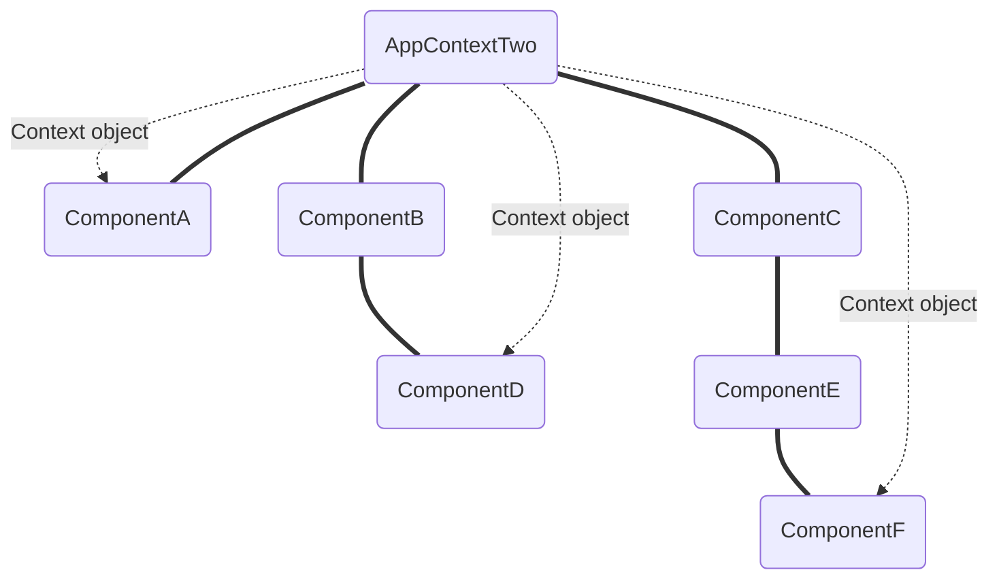

# React Hooks

<!-- vscode-markdown-toc -->
___

## Table of content

___

* 1. [Introduction](#1-introduction)
* 2. [useState Hook](#2-usestate-hook)
  * 2.1. [useState with complex type value](#21-usestate-with-complex-type-value)
* 3. [useEffect Hook](#3-useeffect-hook)
  * 3.1. [useEffect after render and re-renders](#31-useeffect-after-render-and-re-renders)
  * 3.2. [Conditionally run effects](#32-conditionally-run-effects)
  * 3.3. [Run effects only once](#33-run-effects-only-once)
  * 3.4. [useEffect with cleanup](#34-useeffect-with-cleanup)
  * 3.5. [useEffect with incorrect dependency](#35-useeffect-with-incorrect-dependency)
  * 3.6. [Fetching data with useEffect](#36-fetching-data-with-useeffect)
* 4. [useContext Hook](#4-usecontext-hook)
* 5. [useReducer Hook](#5-usereducer-hook)
  * 5.1. [useReducer with simple `state` and `action`](#51-usereducer-with-simple-state-and-action)
  * 5.2. [useReducer with complex `state` and `action`](#52-usereducer-with-complex-state-and-action)
  * 5.3. [Local state management with multiple useReducer](#53-local-state-management-with-multiple-usereducer)
  * 5.4. [Global state management with useReducer and useContext](#54-global-state-management-with-usereducer-and-usecontext)
  * 5.5. [Fetching data with useReducer](#55-fetching-data-with-usereducer)
    * 5.5.1. [Example with useState](#551-example-with-usestate)
    * 5.5.2. [Example with useReducer](#552-example-with-usereducer)
  * 5.6. [useState vs useReducer](#56-usestate-vs-usereducer)
* 6. [useCallback hook](#6-usecallback-hook)
* 7. [useMemo hook](#7-usememo-hook)
* 8. [useRef Hook](#8-useref-hook)

___

<!-- vscode-markdown-toc-config
	numbering=true
	autoSave=true
	/vscode-markdown-toc-config -->
<!-- /vscode-markdown-toc -->

___

## 1. Introduction

___

**React Hooks Tutorial - 1 - Introduction, <https://youtu.be/cF2lQ_gZeA8>**

**What?**  
Hooks is a new feature addition of React version 16.8 that lets you use React features without writing a class.

**Why?**  

1. **Shortcomings of class usage in JavaScript**  
   - Understand how `this` keyword works in JavaScript
   - Remember to bind event handlers in class components
   - Class don't minify very well and make hot reloading very unreliable
2. **Functionality sharing**
   - There is no particular way to reuse stateful somponent logic. By wrapping those components **HOC** and **render props pattern** address this problem but compell you to restructure your code and you end up with a logic flow harder to follow. Hooks allows to reuse components without changing components hierarchy.
3. **<https://youtu.be/cF2lQ_gZeA8?t=310>, <https://youtu.be/06Y6aJzTmXY?t=36>**

___

## 2. `useState` Hook

___

**React Hooks Tutorial - 2 - 3 - useState Hook, <https://youtu.be/lAW1Jmmr9hc>, <https://youtu.be/d0plTCQgsXs>**  
See components: **`ClassCounter.jsx`, `HookCounter.jsx`**

- Only call hooks from within a **React functional Component** not from any other regular JavaScript function.
- Only call hooks at the **top level** of a functional component. Neither within a nested function, nor a loop nor a condtional statement.

See components: **`ClassCounterTwo.jsx`, `HookCounterTwo.jsx`**

- Each time state value depends on previous state value make sure to pass to the state setter function another function which returns the new value based on the previous value.

___

### 2.1. `useState` with complex type value

___

**React Hooks Tutorial - 4 - 5 - useState with object and array <https://youtu.be/-3lL8oyev9w>, <https://youtu.be/RZ5wKYbOM_I>**  
See components: **`HookCounterThree.jsx`, `HookCounterFour.jsx`**

- Whereas **class component `this.setState()`** is always an object the **argument retuned as state from `useState()` hook** may be a primitive type like string, number or boolean and even a complex type like array or object. However, the critical difference between **class component `this.setState()`** and the **setter function returned by `useState()` hook** is that the first merges complex type whereas the second one doesn't. That is why when updating either an object or an array with **setter function returned by `useState()` hook** you must merge the complex type yourself before passing it to the setter.

```js
setObject({ ... object, property: newValue })
// Or
setObject(Object.assign({}, object, { property: newValue }))
// Or
setArray([ ... array, newValue ])
```

___

## 3. `useEffect` Hook

___

**React Hooks Tutorial - 6 - useEffect Hook, <https://youtu.be/06Y6aJzTmXY>**

The **useEffect hook** lets you perform side effects in **functinal components**. It is a close replacement to `componentDidMount`, `componentDidUpdate` and `componentWillUnmount` lifecycle method.

___

### 3.1. `useEffect` after render and re-renders

___

**React Hooks Tutorial - 7 - useEffect after render, <https://youtu.be/nAuWOnFMlOw>**  
See components: **`ClassCounterOne.jsx` (part 1), `HookCounterOne.jsx` (part 1)**

- **How to mimic `componentDidMount` coupled with `componentDidUpdate`** to run **side effect statement** after **initial render** and any **subsequent re-renders** of the component.

Import `useEffect()` in the functional component, call it in the body of that component and pass it as single argument a **side effect function** (e.i. with no return value. :warning: an arrow function may have a return value without return statement):

```js
const functionalComponent = () => {
    // some code

    useEffect(() => {
        // side effect statement
    })

    // some code
    // component return statement
}
```

___

### 3.2. Conditionally run effects

___

**React Hooks Tutorial - 8 - Conditionally run effects, <https://youtu.be/8DYlzVUTC7s>**  
See components: **`ClassCounterOne.jsx` (part 2), `HookCounterOne.jsx` (part 2)**

To avoid elements unnecessary update, besides (optionally) calling `componentDidMount` you have to implement within `componentDidUpdate` conditional update by checking `prevProps` or `prevState` vs `currentProps` or `currentState`

```js
componentDidMount() {
    // side effect statement
}

componentDidUpdate(prevProps, prevState) {
    if (prevState.someState != this.state.someState) {
        // side effect statement
    }
    if (prevProps.someProps != this.props.someProps) {
        // side effect statement
    }
}
```

To conditionally run side effects in a functional component you need to call `useEffect()` hook with a **dependency array** as second argument containing the **props** or **states** to check for before calling the first argument function.

```js
const functionalComponent = () => {
    // some code

    useEffect(
      () => {...},           // side effect statement
      [prevProps, prevState] // dependency array
    )
    // some code
    // component return statement
}
```

___

### 3.3. Run effects only once

___

**React Hooks Tutorial - 9 - Run effects only once, <https://youtu.be/BH4xvzHa7H8>**  
See components: **`ClassMouse.jsx`, `HookMouse.jsx`**

In some cases you need a piece of code to be run only once. For example to register some event listeners you don't want to do it repeatedly but only once. To achieve this in class component you run the code only in `componentDidMount` life cycle method.

```js
componentDidMount() {
    // side effect to run only once
}
```

For a side effect to be run only once in a functional component you need to set `useEffect()` **dependency array** as an **empty array** or **including a value that will never change**.

>:memo: Another technic is to include in the dependency array the very function that is called as side effect in the body of the hook first argument function. Since function value don't use to change the function will be called only after initial rendering.

```js
const functionalComponent = () => {
    // some code

    useEffect(() => {
      // side effect to run only once
    }, [])

    // some code
    // component return statement
}
```

___

### 3.4. `useEffect` with cleanup

___

**React Hooks Tutorial - 10 - useEffect with cleanup, <https://youtu.be/DTlmk6QeOHY>, Memory leak <https://youtu.be/DTlmk6QeOHY?t=167>**  
See components: **`ContainerMouse.jsx` ⇒ (`ClassMouse.jsx` and `HookMouse.jsx`)**

It happens that in order to prevent **memory leaks** (continued running of no longer existing functions incurring memory built up and potentially causing weird consequences or even CPU crash on the long run), before unmounting components you need to **cancel subscriptions**, **clear timers** or **remove event listeners.** In class components you just have to run that **clean up code** in `componentWillUnmount` life cycle method.

```js
componentDidMount() {
    // side effect to run once
}
componentWillUnmount() {
    // clean up code
}
```

To achieve the same performance in functional component you have to provide a `return` statement to `useEffect` hook first argument function. That **`return` statement** must be a callback function that defines **the cleanup code**. <mark>**The return function of useEffect first argument function (that callback function) is run just before any side effect triggered after dependency change. So it is not run after initial rendering (which runs the side effect), however it is run afterward just before any side effect and ultimately just before the component unmounts.**</mark>

- Running a side effect in function of a dependency that changes at a high frequency is performance heavy. It can be prevented by setting a timer to schedule the side effect. That is **debalancing**.  
  The trick is the timer alone won't help much since function calls are stacked to be eventually called regardless of delays.  
  So you can use the third feature of useEffect hook, (the returned callback function) **to clean any uncalled timer on any due subsequent side effect since that callback function is run just before any side effect triggered after dependency change.**  

```js
const functionalComponent = () => {
    // some code

    useEffect(
        () => {
            //(1) side effect code
            return () => {
                //(3) clean up code
            }
        },
        [...], //(2) Dependency array if any
    );

    // some code
    // component return statement
}
```

___

### 3.5. `useEffect` with incorrect dependency

___

**React Hooks Tutorial - 11 - useEffect with incorrect dependency <https://youtu.be/SP-NrbQHFww?t=302>**  
See components: **`IntervalHookCounter.jsx`, `IntervalClassCounter.jsx`**

`useEffect` hook dependency array does not let you know when to run the side effect function but is better thought as a way to tell **React** which value change to watch for before running the side effect function. <mark>Always think before defining an empty dependency array.</mark>

When you need to run a funcion within `useEffect()` first argument function, for you not to forget that any argument to the first function is a dependency it is recommanded to go ahead and define that function within the second.

```js
const functionalComponent = () => {
    // some code
    // doSomething could have been defined here
    useEffect(() => {
      // side effect code
      function doSomething(someParam) {
        // side effect code using someParam
      }
      // then you call it
      doSomething(someArgu);
      /** 
       * Don't forget that in such a case someParam
       * (knowing that someParam === someArgu) becomes a
       * dependency to check for to call the side effect function
      */
    }, [someArgu])

    // some code
    // component return statement
}
```

:memo: To run multiple side effects just call `useEffect()` hook as many times within the same component.

___

### 3.6. Fetching data with `useEffect`

___

**React Hooks Tutorial - 12 - 13 - 14 - Fetching data with useEffect, <https://youtu.be/bYFYF2GnMy8>, <https://youtu.be/1tfd6ANaNRY>, <https://youtu.be/zm_09NER-R0>**  
See components: **`DataFetching.jsx`**

You can use the **Fetch API** or some HTTP library like **Axios**. When the request is triggered on a button click you can make it from within the click handler or from `useEffect` but make sure to populate the dependency array accordingly.

___

## 4. `useContext` Hook

___

**React Hooks Tutorial - 15 - 16 - 17 - useContext Hook, <https://youtu.be/CI7EYWmRDJE>, <https://youtu.be/tEqNSOhCHLU>, <https://youtu.be/UjjtvroahBU>**  
See components sub-tree: **`App.jsx` ⇒ `ComponentC.jsx` ⇒ `ComponentE.jsx` ⇒ `ComponentF.jsx` ⇒ `ComponentH.jsx`**

To **directly** pass data from a parent component to its descendant components multiple level down the components tree you can apply `React.createContext()` technic in **functional component** the same way you apply it in **class component**

- First 3 steps:

```js
//(1) Import createContext()
import React, { createContext } from "react";
import ComponentE from "./ComponentE";
//(2) Create (as named export) the context objects with optional default values
export const CourseContext = createContext("C-mainCourse");
export const DessertContext = createContext("C-dessert");

const ComponentC = () => {
  return (
    <div> ComponentC
      {/* (3) Provide specific context values if any */}
      <CourseContext.Provider value={"C-couscousRoyal"}>
        <DessertContext.Provider value={"C-applePie"}>
          <ComponentE />
        </DessertContext.Provider>
      </CourseContext.Provider>
    </div>
  );
};

export default ComponentC;
```

- Last 2 steps

```js
import React from "react";
// (4) Import the context objects
import { CourseContext, DessertContext } from "./ComponentC";

const ComponentH = () => {
  return (
    // (5) Consume context values with nested function definitions
    <CourseContext.Consumer>
      {
        (mainCourse) => (
          <DessertContext.Consumer>
            {
              (dessert) => <div>ComponentH consume {mainCourse} and {dessert}</div>
            }
          </DessertContext.Consumer>
        )
      }
    </CourseContext.Consumer>
  );
};

export default ComponentH;
```

We notice that just to consume two values the code becomes circumvoluted and much less readable. That is where **`React.useContext()` hook** comes into play.

```js
// (1) Import the hook and context objects
import React, { useContext } from "react";
import { CourseContext, DessertContext } from "./ComponentC";

const ComponentF = () => {
  // (2) retrieve context values
  const course = useContext(CourseContext);
  const dessert = useContext(DessertContext);
  // (3) consume the values
  return (
    <div>ComponentF consume {course} and {dessert}</div>
  );
};

export default ComponentF;
```

  :bulb::bulb::bulb: **Best Practice**

- As with prop drilling, there can be some [performance drain when using Context][1]. Whenever the `Context.Provider` component renders, its child components also render. One way to minimize rendering is to **create and provide** Context as close to where it’s being used as possible. Although we could position it higher up in the component tree, it would be less effective.
- In case you plan to provide context from more than one component sub-branche it is better to create context in a module of its own, with a higher order function as context provider. This technic makes it easier to create multiple contexts and provide them at once through the higher order function component. Dont forget to export the context object as well to make it easier to consume through `useContext` hook, since context object `Consumer` component entails cumbersome nesting mostly in case of multiple context.

___

## 5. `useReducer` Hook

___

**React Hooks Tutorial - 18 - useReducer Hook, <https://youtu.be/cVYp4u1m6iA>**

___

### 5.1. `useReducer` with simple `state` and `action`

___

**React Hooks Tutorial - 19 - useReducer (simple state & action), <https://youtu.be/IHJ-TO_1nME>**

To manage state with **useReducer** follow the steps:

- **To keep in mind:** Within the body of the **functional component** you will call `React.useReducer(reducerFunction, initialState)` with two parameters. The **reducer function** will be used by the hook to manage state update.
- **After creating the hook:** Out of the body of the **functional component** define the **`initialState` constante of any JavaScript type** and define the **`reducer(state, action)` function** with two parameters **`state` (any JavaScript type)** and **`action` (any JavaScript type)**. The first parameters is used as previous value to update state. The second parameter, a JavaScript data type used as action data provider about how to update the state, is used as the **conditional `case`** in a **`switch` statement.**
- **1st Create the hook:** Within the body of the **functional component** call `React.useReducer(reducerFunction, initialState)` hook with two arguments and retrieve the **two values it returns** with **destructuring assignment within the array `[stateIdentifier, dispatch]`.** The `stateIdentifier` (named as you see fit) is the state value managed by **useReducer** and initialized on step 2. `dispatch()` is a mandatory named method provided as communication channel to tell **useReducer** how to update state on the basis of the **`action` value.**
- **2nd step:** Make use of the returned `stateIdentifier` as you need and to **declaratively tell React how to manage state,** within an event handler, call `dispatch(action)` method and pass it the specific **action value.**

```js
// Example of useReducer
import React, { useReducer } from "react";
// (3)
const initialState = 0;
const reducer = (state, action) => {
  switch (action) {
    case "increment":
      return state + 1;
    case "decrement":
      return state - 1;
    case "reset":
      return initialState;
    default:
      return state;
  }
};

const ReduCounterOne = () => {
  // (1) => (2)
  const [count, dispatch] = useReducer(reducer, initialState);
  // (4)
  return (
    <div>
      <p>Count: {count}</p>
      <button onClick={() => dispatch("increment")}>Increment</button>
      <button onClick={() => dispatch("decrement")}>Decrement</button>
      <button onClick={() => dispatch("reset")}>Reset</button>
    </div>
  );
};

export default ReduCounterOne;
```

___

### 5.2. `useReducer` with complex `state` and `action`

___

**React Hooks Tutorial - 20 - useReducer (complex state & action), <https://youtu.be/uX7lxFrWUbA>**

**useReducer** doesn't reveal its full **state management power** until you pass `state` and `action` as **complex type** arguments instead of simple type to the `reducer()` function.

- Using a complex type as `action` value enables to **provide more data to fine tune state management**.

```js
import React, { useReducer } from "react";

const initialState = 0;
const reducer = (state, action) => {
  // (2) Change the switch argument accordingly
  switch (action.type) {
    case "crement_A":
      // (3) Update state accordingly
      return state + action.value;
    case "reset":
      return initialState;
    default:
      return;
  }
};

const ReduCounterTwo = () => {
  const [count, dispatch] = useReducer(reducer, initialState);
  /** 
   * (1) Change the value of dispatch() method argument from
   * simple to complex type
  */
  return (
    <div>
      <p>Count A: {count}</p>
      <button onClick={() => dispatch({ type: "crement_A", value: -5 })}>
        A Decrement 5
      </button>
      <button onClick={() => dispatch({ type: "crement_A", value: -1 })}>
        A Decrement
      </button>
      <button onClick={() => dispatch({ type: "crement_A", value: 1 })}>
        A Increment
      </button>
      <button onClick={() => dispatch({ type: "crement_A", value: 10 })}>
        A Increment 10
      </button>
      <button onClick={() => dispatch({ type: "reset" })}>Reset</button>
    </div>
  );
};

export default ReduCounterTwo;
```

- Using an complex type as `state` value enables to **keep track of multiple state variables within the same object**.

```js
import React, { useReducer } from "react";
// (1) Assign a complex type value to initial state
const initialState = {
  count_A: 0,
  count_B: 10,
};
const reducer = (state, action) => {
  switch (action.type) {
    case "crement_A":
      // (3) Merge state object to enable proper update
      return { ... state, count_A: state.count_A + action.value };
    case "crement_B":
      // (3) Merge state object to enable proper update
      return { ... state, count_B: state.count_B + action.value };
    case "reset":
      return initialState;
    default:
      return;
  }
};

const ReduCounterTwo = () => {
  const [count, dispatch] = useReducer(reducer, initialState);

  return (
    <div>
      {/* (2) Make use of state according to its type */}
      <p>Count A: {count.count_A}</p>
      <p>Count B: {count.count_B}</p>
      <button onClick={() => dispatch({ type: "crement_A", value: -5 })}>A Decrement 5</button>
      <button onClick={() => dispatch({ type: "crement_A", value: -1 })}>A Decrement</button>
      <button onClick={() => dispatch({ type: "crement_A", value: 1 })}>A Increment</button>
      <button onClick={() => dispatch({ type: "crement_A", value: 10 })}>A Increment 10</button>
      <br />
      <button onClick={() => dispatch({ type: "crement_B", value: -1 })}>B Decrement</button>
      <button onClick={() => dispatch({ type: "crement_B", value: 1 })}>B Increment</button>
      <br />
      <button onClick={() => dispatch({ type: "reset" })}>Reset</button>
    </div>
  );
};

export default ReduCounterTwo;

```

<mark>:warning: Maintaining multiple state variables in a single state object is suited when dealing with **global state.** When dealing with **local state** there is a better technic as shown in the next section.</mark>

___

### 5.3. Local state management with multiple `useReducer`

___

**React Hooks Tutorial - 21 - Multiple useReducers, <https://youtu.be/5DsCKNRA8s4>**

- **Local state management** happens you want to maintain multiple **states** used by a single component and the best practice is to use multiple `useReducer()`.
- This technic is particularly useful when those states follow the same transition pattern. This technic avoid you to have to merge the `state` if it were to be an object and prevents you from duplicating code within the `reducer` function.
- Example:

```js
import React, { useReducer } from "react";

const initialState = 0;
const reducer = (state, action) => {
  switch (action.type) {
    case "crement":
      return state + action.value;
    case "reset":
      return initialState;
    default:
      return;
  }
};

const ReduCounterThree = () => {
  const [count_A, dispatch_A] = useReducer(reducer, initialState);
  const [count_B, dispatch_B] = useReducer(reducer, initialState);

  return (
    <div>
      <p>Count A: {count_A}</p>
      <button onClick={() => dispatch_A({type: "crement", value: -1})}>Decrement</button>
      <button onClick={() => dispatch_A({type: "reset"})}>Reset</button>
      <button onClick={() => dispatch_A({type: "crement", value: 1})}>Increment</button>
      <p>Count B: {count_B}</p>
      <button onClick={() => dispatch_B({type: "crement", value: -1})}>Decrement</button>
      <button onClick={() => dispatch_B({type: "reset"})}>Reset</button>
      <button onClick={() => dispatch_B({type: "crement", value: 1})}>Increment</button>
    </div>
  );
};

export default ReduCounterThree;
```

___

### 5.4. Global state management with `useReducer` and `useContext`

___

**React Hooks Tutorial - 22 - useReducer with useContext, <https://youtu.be/BCD2irXaVoE>**

See components:



- **Global state management** happens when **states** created in the root component of your application are needed and optinally updated in deeply nested components.

- In such cases, besides the possibility of setting the state as an object, combining `useContext` with `useReducer` optimize performance for components that trigger deep updates because you can pass **`dispatch`** down instead of **callback handlers**.

- In the root component:

```js
//(1.2) Initialize initial (or default) state
const initialState = 0;
//(1.3) Define the reducer function
const reducer = (state, action) => {
  switch (action.type) {
    case "crement":
      return state + action.value;
    case "reset":
      return initialState;
    default:
      return state;
  }
};
//(2) Create and export the context object
export const CountContext = React.createContext();

export default function AppContextTwo() {
  //(1.1) Create the global state optionally as a complex type 
  const [count, dispatch] = React.useReducer(reducer, initialState)
/** (3)
 * Provide the context value and set its value as a complex type which
 * elements are the values returned by useReducer hook
 * If their order of precedence matters use an array
 * If only their identity matters use an object
*/
  return (
    <div>
      <h1>AppContextTwo: {count}</h1>
      <CountContext.Provider value={{countState: count, countDispatch: dispatch}}>
        <CompA />
        <CompB />
        <CompC />
      </CountContext.Provider>
    </div>
  );
};
```

- In the descendant components:

```js
//(1) Make sure to import the context object
import { CountContext } from "./AppContextTwo";

export default function CompF() {
  //(2) Call useContext hook with the context object as argument to retreive the context value
  const  { countState, countDispatch } = React.useContext(CountContext);
  //(3) Update state by passing an action parameter to the dispatch method
  return (
    <div>
      <h2>CompF: {countState}</h2>
      <button onClick={() => countDispatch({ type: "crement", value: -1 })} >Decrement</button>
      <button onClick={() => countDispatch({ type: "reset" })} >Reset</button>
      <button onClick={() => countDispatch({ type: "crement", value: 1 })} >Increment</button>
    </div>
  );
};
```

___

### 5.5. Fetching data with `useReducer`

___

**React Hooks Tutorial - 23 - 24 - Fetching data with useReducer, <https://youtu.be/snzS7-73SEQ>, <https://youtu.be/imjfiXxvMD8>**

___

#### 5.5.1. Example with `useState`

___

```js
import React, { useState, useEffect } from 'react'
import axios from 'axios';

const DataFetchingOne = () => {
  const [loading, setLoading] = useState(true);
  const [post, setPost] = useState({});
  const [error, setError] = useState('');

  useEffect(() => {
    axios.get('https://jsonplaceholder.typicode.com/posts/33')
      .then(response => {
        setLoading(false);
        setPost(response.data);
        setError('');
      })
      .catch(error => {
        setLoading(false);
        setPost({});
        setError(error.message);
      })
  }, [])

  return (
    <div>
        {loading ? 'Loading...' : post.title}
        {error ? error : null}
    </div>
  )
}

export default DataFetchingOne
```

___

#### 5.5.2. Example with `useReducer`

___

```js
import React, { useEffect, useReducer } from 'react';
import axios from 'axios';

const initialState = {
  loading: true,
  post: {},
  error: '',
}
const reducer = (state, action) => {
  switch (action.type) {
    case 'FETCH_SUCCESS':
      return {
        loading: false,
        post: action.payload,
        error: '',
      };
    case 'FETCH_ERROR':
      return {
        loading: false,
        post: {},
        error: action.payload,
      };
    default:
      return state;
  }
}

const DataFetchingTwo = () => {

  const [state, dispatch] = useReducer(reducer, initialState);
  const { loading, post, error } = state;

  useEffect(() => {
    axios.get('https://jsonplaceholder.typicode.com/posts/21')
      .then(response => {
        dispatch({ type: 'FETCH_SUCCESS', payload: response.data })
      })
      .catch(error => {
        dispatch({ type: 'FETCH_ERROR', payload: error.message })
      })
  }, []);

  return (
    <div>
      { loading ? 'Loading...' : post.title }
      { error ? error : null }
    </div>
  )
}

export default DataFetchingTwo
```

___

### 5.6. `useState` vs `useReducer`

___

**React Hooks Tutorial - 25 - useState vs useReducer, <https://youtu.be/3VClygDRSsU>**

| Scenario | useState | useReducer |
|:-:|-|-|
|**Type of state**|Number, string, boolean|Object or array|
|**Number of transitions**|One or two|Too many|
|**Related state transitions?**|No|Yes|
|**Business logic**|No business logic|Complex business logic|
|**Local vs Global**|Local|Global|

___

## 6. `useCallback` hook

___

**React Hooks Tutorial - 26 - useCallback Hook, <https://youtu.be/IL82CzlaCys?t=714>**  
**Robin Wieruch: <https://www.robinwieruch.de/react-usecallback-hook/>**  
See component: **`ParentComponent.jsx`**  
See component: **`rwieruch/AppUseCallback.jsx`**

**What?**  
React's **`useCallback`** works by **returning a memoized version of the callback function that only changes if one of the dependencies change**.

**Why?**  
<mark>It is useful when passing callback handlers to optimised children components (e.i. turned pure components with **`React.memo` API**) that rely on reference equality (e.i. performed with **shallow comparaison**) to prevent unnecessary renders.

&#9888; **WARNING**  
Keep in mind that most of the performance optimizations in React are premature. React is fast by default, so every performance optimization is opt-in in case something starts to feel slow.

The following **`removeItem`** function could now be passed to deeply nested children optimised with **`React.memo` API** whithout beeing affected by state change of the parent component containing the **`removeItem`** function.  

```js
  const removeItem = React.useCallback(
    (id) => setUsers(users.filter((user) => user.id != id)), //cached function
    [users]                                                 // dependency array
  );
```

:memo: Don't mistake React's **`useCallback`** Hook with React's **`useMemo`** Hook. While **`useCallback`** is used to memoize functions, **`useMemo`** is used to memoize values.

:memo: Don't mistake React's **`useCallback`** Hook with **`React.memo` API**. While **`useCallback`** is used to memoize functions, **`React.memo`** is used to wrap React components to prevent re-renderings.

___

## 7. `useMemo` hook

___

**React Hooks Tutorial - 27 - useMemo Hook, <https://youtu.be/qySZIzZvZOY>**  
**Robin Wieruch: <https://www.robinwieruch.de/react-usememo-hook/>**  
See component: **`CounterUseMemo.jsx`**  
See component: **`rwieruch/AppUseMemo.jsx`**

When you need to cache a function use **`useCallback`** but when you need to cache either **the value return by a function** or **any value** use **`useMemo`.**

Like **`useCallback`, `useMemo`** requires a function to  **memoize**. However, whereas **`useCallback`** caches the whole function (which is more often a callback handler), **`useMemo`** calls the function and caches its value, for the function to be called again only if the value dependency changes.

```js
  const isEven = () => {
    let i = 0;
    while(i < 1000000000) i++;

    return counterOne % 2 === 0;
  };
```

<mark>Contrary to what it seems it is not the whole preceding function that is passed to **`useMemo`,** but only its body. The fact is **`useMemo`** needs a callback function with a **RETURN VALUE** to **memoize.**</mark>

```js
  /** 
   * In this specific example, after applying useMemo the value
   * of the isEven varaible changes from beeing a function
   * to become the mere value return by this function 
  */
  const isEven = useMemo(() => {
    let i = 0;
    while(i < 1000000000) i++;

    return counterOne % 2 === 0;
  }, [counterOne]);
```

📝 You might be wondering why you wouldn't use **React's performance optimisation Hooks `useCallback` and `useMemo`** on all your functions or why they are not the default for all functions in the first place.

Internally, those Hooks have to compare the dependencies from the dependency array for every re-render to decide whether it should re-define the function. Often the computation for this comparison can be more expensive than just re-defining the function.

___

## 8. `useRef` Hook

___

**React Hooks Tutorial - 28 - 29 - useRef Hook, <https://youtu.be/yCS2m01bQ6w>, <https://youtu.be/LWg0OyZQffc>**  
<!-- **Robin Wieruch: <https://www.robinwieruch.de/react-usememo-hook/>**   -->
See component: **from `vishwasHook/` ⇒ `FocusInput.jsx`, `ClassTimer.jsx`, `HookTimer.jsx`**  
<!-- See component: **`rwieruch/AppUseMemo.jsx`** -->

`useRef` hook is mostly used in the following use cases:

1. **Imperative programming to access DOM nodes**

     ```js
     // Parent component
     import ComponentWithDOMApi from './ComponentWithDOMApi'

     const AppUseRef = () => {
       return (
         <div>
           <ComponentWithDOMApi
             label="label"
             value="Value"
             isFocus
           />
         </div>
       )
     }

     // Child component
     const ComponentWithDOMApi = ({ label, value, isFocus }) => {
       const inputRef = React.useRef();

       React.useEffect(() => {
         if(isFocus) {
           inputRef.current.focus();
         }
       }, [isFocus])

       return (
         <>
           <label>
             {label}: <input type="text" value={value} ref={inputRef} />
           </label>
         </>
       )
     }
      ```

2. It can be used to create a generic container which can hold a mutable value similar to class component instance fields. This generic container does not cause re-render when the data it stores changes. At the same time it also remembers the state of the stored data even after other stateful variables cause re-render of this component
3. The ref can be used as **instance variable** for a function component in React whenever we need to track some kind of state without using React's re-render mechanism. For example, we can track whether a component has been rendered for the first time or whether it has been re-rendered:
4. **Rule of thumb: Whenever you need to track state in your React component which shouldn't trigger a re-render of your component, you can use React's useRef Hooks to create an instance variable for it.**

   ```js
    const isFirstRender = useRef(true);

    useEffect(() => {
    if(isFirstRender.current) isFirstRender.current = false;
    });
   ```

## 8. `useImperativeHandle` hook

The `useImperativeHandle` hook lets you create a _handle_ or _custom name_ for a value exposed to a parent component using a `ref`. This is useful when using `React.forwardRef` to forward a `ref` attribute from one component to its child.

The main value of `useImperativeHandle` is a callback function that must return an object `{ key: value }`: `key` is the _handle_  to remotely(imperatively) "handle" from the parent (`childComponentRef.current.key`) the child functionality (`value`) subscribed to through the **forwarded ref**.

For example, in the following example, a component called `CountingBox` is created that contains a `<textarea>`. The `ref` attribute passed into the `CountingBox` component will be forwarded and attached to the `<textarea>`. The `useImperativeHandle` hook is then used to make a new property of the `ref.current` object (called `count` in this case) available to the parent component. LISTING 11-16: Customizing a value exposed by a ref

```js
import {useState,useRef,useImperativeHandle,forwardRef} from 'react';

// Child component
const CountingBox = forwardRef((props, ref) => { 
  const [text,setText] = useState('');
 
  useImperativeHandle(ref, () => {
      return {count: text.split(" ").length}
  },[text]);
 
  return (
    <>  
      <textarea value={text} onChange={(e)=>setText(e.target.value)} />
    </>
  );
});

// Parent component
function TextEdit(props) {
  const countingBoxRef = useRef();
  const [wordCount,setWordCount] = useState(0);
 
  const handleClick = (count) => {
    setWordCount(count)
  }
 
  return (
    <> 
       <CountingBox ref={countingBoxRef} /><br />
       <button onClick={()=>handleClick(countingBoxRef.current.count)}>
       count words
       </button><br />
       current count: {wordCount}<br />
    </>
  )
};

export default TextEdit;
```

- :memo: Notice that `useImperativeHandle` has a third argument, which is a dependency array (similar to that used by `useEffect` , `useCallback` , and `useMemo`). In the current version of React, `useImperativeHandle` memoizes the value of the handle, which can be a problem if you're trying to get an updated value (as in this case). Specifying a dependency that changes with each render solves the problem.

💡 <mark>**The `useImperativeHandle` hook is the least important hook to fully understand. In most cases, anything you want to do using `useImperativeHandle` can be better done by passing props from parent components to child components.**</mark>

## 9. `useLayoutEffect` kook to update the DOM Synchronously

The `useLayoutEffect` hook is identical to `useEffect` in every way, except in when and how it executes. Whereas `useEffect` runs its functions asynchronously (that is, without blocking anything else) after the component appears in the browser, `useLayoutEffect` runs its function before the DOM is painted to the browser, and it runs synchronously. The `useLayoutEffect` hook can be used in cases where an effect results in changes to the DOM and where the `useEffect` hook may cause flicker or inconsistent display of the results.

Minnick, Chris. Beginning ReactJS Foundations Building User Interfaces with ReactJS (pp. 280-281). Wiley. Kindle Edition.

[1]: https://blog.logrocket.com/react-context-api-deep-dive-examples/
